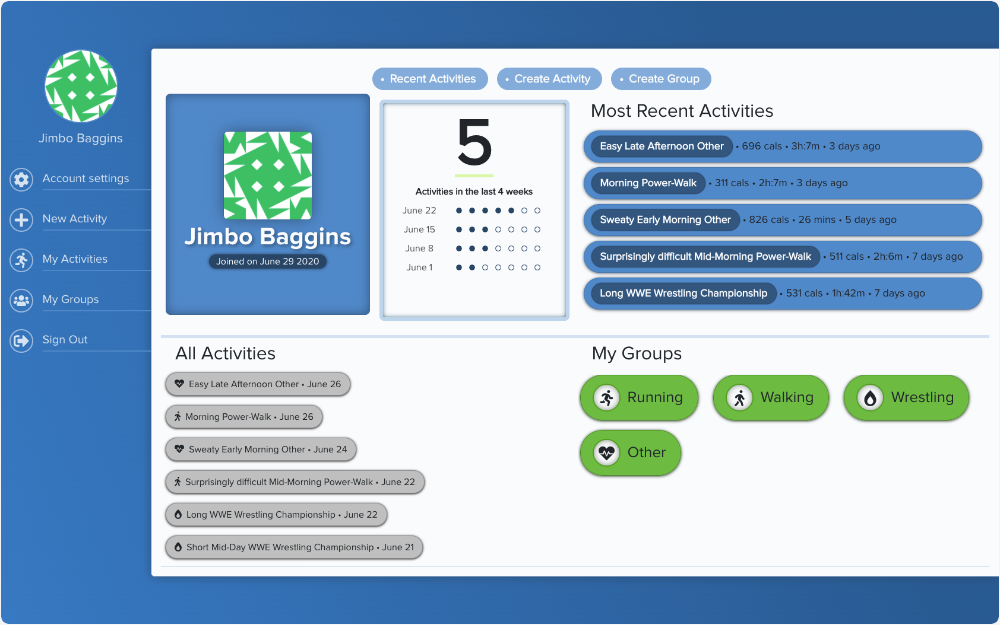

  

  <h1 align="center"> 🏃🏽🏃🏽‍♀️ Activity Tracker</h1>

<h3 align='center'>  
    An Activity Tracker with Groups, Memberships, Stats and KOMs
</h3>

     
    <a href="#"><strong>Visit The Site »</strong></a>
     
     
    <a href="#">Download this repository</a>
    |
    <a href="#">Report A Bug</a>
    |
    <a href="#">Fork It</a>
  

## 📑 Table of Contents
  - [The Project Brief](https://github.com/Rhelli/RoR-Capstone---Activity-Tracker/tree/release/0.1.0#-the-project-brief)
  - [The Nitty Gritty](https://github.com/Rhelli/RoR-Capstone---Activity-Tracker/tree/release/0.1.0#%EF%B8%8F-the-nitty-gritty)
  - [Tools & Technology Used](https://github.com/Rhelli/RoR-Capstone---Activity-Tracker/tree/release/0.1.0#-tools--technology-used)
  - [Setup & Use](https://github.com/Rhelli/RoR-Capstone---Activity-Tracker/tree/release/0.1.0#-setup--use)
  - [Showcase](https://github.com/Rhelli/RoR-Capstone---Activity-Tracker/tree/release/0.1.0#-feature-previews)
  - [Contributions, Issues and Forking](https://github.com/Rhelli/RoR-Capstone---Activity-Tracker/tree/release/0.1.0#%EF%B8%8F-contributions-issues-and-forking)
  - [Creator](https://github.com/Rhelli/RoR-Capstone---Activity-Tracker/tree/release/0.1.0#-creator)
  - [Show Your Support!](https://github.com/Rhelli/RoR-Capstone---Activity-Tracker/tree/release/0.1.0#-show-your-support)
  - [Credit & Acknowledgements](https://github.com/Rhelli/RoR-Capstone---Activity-Tracker/tree/release/0.1.0#credits--acknowledgements)
  - [Licensing](https://github.com/Rhelli/RoR-Capstone---Activity-Tracker/tree/release/0.1.0#%EF%B8%8F-licensing)

## 🔰 The Project Brief

This is the Ruby on Rails Capstone Project, to be completed by students of [Microverse](https://www.microverse.org/).

This project is unlike those that have come before it. We are required to adhere to the following guidelines:
 - Mandatory technical specifications to reach
 - A design brief to follow
 - Presentation of the project once finished, providing a demo, project features, extra features and how we tackled the n+1 problem.
 - 5 day build time for a Minimum Viable Product

The Capstone therefore demonstrates itself to be a more true-to-form application of our skills to real-world projects, providing us with valuable experience of creating deliverables under time pressure.

## 🛠️ The Nitty Gritty
The project objective was to build a Ruby on Rails based web application that would group a chosen item together, for example, payments, projects between friends, or in the case of this project, activities.

The design guidelines followed that of [Snapscan](https://www.behance.net/gallery/19759151/Snapscan-iOs-design-and-branding?tracking_source=), designed by Gregoire Vella, however a certain amount of wiggle room beyond the colors, typographies and general layout was allowed.

Beyond the familiar groups, memberships and users features, this project focused on bringing some, albeit rudimentary, statistics to the user - a feature that is commonplace today in activity trackers.

## 🔬 Tools & Technology Used
**Languages & Frameworks**
 - Ruby 2.7.1
 - Ruby on Rails 6.0.3.1
 - SASS/CSS3
 - Bootstrap

**Gems of note**
 - [Devise](https://github.com/heartcombo/devise)
 - [Faker](https://github.com/faker-ruby/faker)
 - [HIRB](https://github.com/cldwalker/hirb)  (GOAT Award 🥇)
 - [Bullet](https://github.com/flyerhzm/bullet)
 - [FontAwesome](https://rubygems.org/gems/font-awesome-rails/versions/4.7.0.2)

**Testing**
 - [RSpec 3.9](https://rspec.info/)

**Database**
 - PostgreSQL

**Linters & Quality Control**
 - [Stickler CI](https://stickler-ci.com/)
 - [Rubocop 0.85.0](https://github.com/rubocop-hq/rubocop-rails)

**Deployment**
 - Heroku

### 💻 Setup & Use
Follow [this link](#) to see a live version of the project. If you'd like a closer look, continue reading....

#### Setup
Setup should be fairly straightforward. You will have to ensure your machine is properly equipped to run the code first:
  1. Make sure you have both [Ruby](https://www.ruby-lang.org/en/documentation/installation/) and Ruby on Rails ([Mac](https://gorails.com/setup/osx/10.15-catalina) • [Linux](https://gorails.com/setup/ubuntu/19.10) • [Windows](https://gorails.com/setup/windows/10)) installed.
  2. Download this repository.
  3. **`cd`** into the root directory of wherever you download this repo. [What does 'cd' mean?](https://www.macworld.com/article/2042378/master-the-command-line-navigating-files-and-folders.html)
  4. Whilst at the root (home) directory of this project, enter **`bundle install`** to install the projects software dependencies.
  5. In your terminal window, enter **`rails server`** to start the server.
  6. Now navigate to **`localhost:3000`** in your browser to start playing around with the webpages!

Alternatively if you'd like to confirm the entire project is passing testing:
  1. **`cd`** into this repository in your terminal
  2. Enter **`bundle exec rspec`** to run all tests

******

## 🎬 Feature Previews

### Creating Activities, getting statistics and Deleting Activities

> Creating an activity will log it immediately, provide you with its statistics on the Activity Page and increment the weekly activity count on the users profile. 

### Creating and Destroying Groups

> From the 'My Groups' page, the user can see all their active group memberships, as well as suggested groups not yet joined. Continuing to the 'Create Group' page allows the user to create a new group with a name, description and auto-populated group icon. A new group will appear site wide.

### The Group Page, KOMs and Membership

> Navigating from the 'My Groups' page, the user can find new groups in the 'Suggested Groups' section. On the Group page itself, the user is presented with the option to join (or leave) the group, the current member list with [KOMs](https://en.wikipedia.org/wiki/King_of_the_Mountains) and trophies and recent activities at the bottom.

*******

## 🛎️ Contributions, Issues and Forking

Contributions, issues and feature requests are more than welcome! 

If you have any problems running or setting this project up, please submit it as a bug on the [issues page.](https://github.com/Rhelli/StayInTouch-Social-Media/issues) right away!

If you want to make your own changes, modifications or improvements, go ahead and Fork it!
1. [Fork it](https://github.com/Rhelli/StayInTouch-Social-Media/fork)
2. Create your working branch (git checkout -b [choose-a-name])
3. Commit your changes (git commit -am 'what this commit will fix/add/improve')
4. Push to the branch (git push origin [chosen-name])
5. Create a new Pull Request

## 💂🏽💻 Creator

Rory Hellier - [Github](https://github.com/Rhelli)

## 🖐🏼 Show Your Support!
Give a ⭐️ if you like this project!

## 🍻 Credits & Acknowledgements
The original design specifications and influence for this project are drawn from [Gregoire Vella's Snapscan](https://www.behance.net/gallery/19759151/Snapscan-iOs-design-and-branding?tracking_source=) design on Behance.

## ⚖️ Licensing
This project is [MIT](https://github.com/Rhelli/StayInTouch-Social-Media/LICENSE.txt) licensed.
